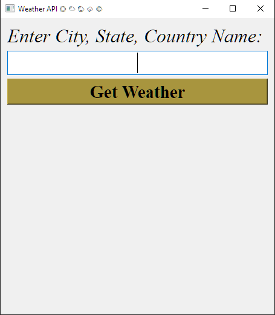

# AhabOWAPI

*Beginner-friendly client-side weather desktop app* built with Python and PyQt5.<br>
Improved version from the popular <a href="https://www.youtube.com/@BroCodez">Bro Code</a> PyQt5 weather tutorial. Focused on the <a href="https://www.iso.org/obp/ui/#iso:pub:PUB500001:en">ISO 3166-1 Country Code (link in English)</a> support for accurate global searches (within some margin of error, of course)<br><br>

### Main UI:

---

## Why AhabOWAPI?
- Strong focus on `City, State, Country Code` format (Birmingham, BIR, GB; Tokyo, 13)
- Easy swap from Fahrenheit to Celsius
- Improved from the original tutorial
- Easy to understand and extend

## Features
- Current weather with actual (A:), feeling like (F: ), and an emoji description with text beneath.
- Supports Celsius / Fahrenheit (Simple comment swap)
- Proper Error handling (three fields, HTTP issues)
- Global City lookup using ISO codes
- Simple GUI

## Installation

1. Clone the Repo:
```bash
git clone https://github.com/Sgt-Ahab/AhabOWAPI
```
2. Install dependencies:
```bash
pip install -r requirements.txt
```
3. Get your free API key from <a href="https://openweathermap.org/api">OpenWeatherMap</a>
4. Open `ahab_weather.py` and replace `API_KEY` with your key.
5. Run:
```bash
python ahab_weather.py
```

## Usage
- Enter in the format: City, State, Country Code(ISO 3166-1 compliant)
- Examples:
    - London, LND, GB
    - Paris, 75C, FR
    - Beijing, BJ, CN; OR Beijing, , CN <- Empty State is allowed


## Future / Related Products
- WeatherNoob -> Advanced multi-location array-based widget (coming soon)

## Contributing
Contributions welcome! See `CONTRIBUTING.md` for details.

---
 
 ## Support the Project:
 If you found this tool useful, and wish to donate, you can support <a href="https://www.buymeacoffee.com/sgtahab">here</a>! 🎓💡

###### Made with ♥ by a fellow learner turning tough days into code